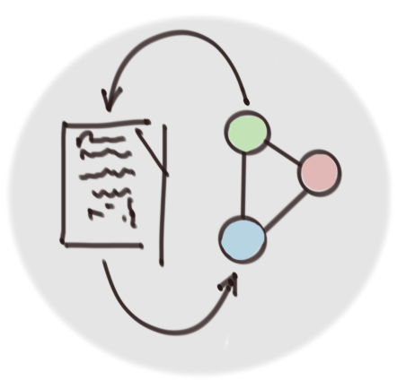
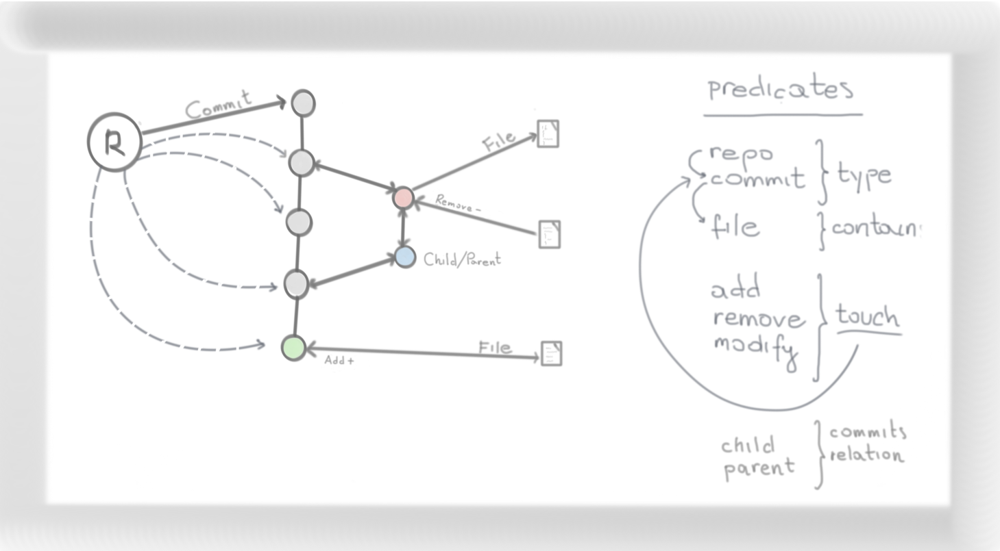

# codegraph

  An unofficial experiment with graph structures mainly focused on *git* repositories and *uast* (unified abstract syntax tree) representation.

### installation

Get the latest [release](https://github.com/cayleygraph/cayley/releases) of Cayley, to be able to query the results.

```bash
$ go install ./cmd/codegraph
```


## git

Proof of concept - modeling git (commits) with graph database.

...a little bit inspired by ["Modeling Git Commits with Neo4j"](https://reflectoring.io/git-neo4j/)

### data model



#### repo

A repo nodes represent git repositories. Every repo keeps connections with all your commits.

#### commit

A commit node represents a commit in git log history. Commits are connected to own children and parents. Also, from commits we can go to files which they contain.

#### file

A file node represents a file in git repository. Every commit is connected to own files, but file also can be connected with commits which touched (added, removed, or modified) the file.

### usage

This PoC exposes an API and following tools:
* import - lets you import a git repository into graph database (backed by cayley.io).
```bash
Usage:
  codegraph git import <repo> [<repos>...] [flags]

Flags:
  -h, --help   help for import

Global Flags:
  -a, --db string   database directory (default "./")
```

* export - opens a graph database and exports _quads_ in raw format.
```bash
Usage:
  codegraph git export [flags]

Flags:
  -h, --help   help for export

Global Flags:
  -a, --db string   database directory (default "./")
```

* stats  - prints commit statistics per repo (based on data in graph database).
```bash
Usage:
  codegraph git stats [flags]

Flags:
  -h, --help          help for stats
  -n, --limit int     top commits per git repository (0 means no limit)
      --nomerge       do not show merge commits
      --sort string   sort commits by [add, remove, modify, touch, file] (default "touch")

Global Flags:
  -a, --db string   database directory (default "./")


$ codegraphgit stats --limit 3 --sort touch --nomerge


<git@gitlab.com:kuba--/gitgraph.git>
--
commit: <198af24465fdfe4b9a74970fd13721a48cd29558>
"commit 198af24465fdfe4b9a74970fd13721a48cd29558
Author: Kuba Podgórski
Date:   Wed Jun 26 08:22:47 2019 +0000
    poc implementation

    three tools - import git repo into db, export db to raw, print stats
"
12 files, 9 touched (+, -, #), 9 added(+), 0 removed(-), 0 modified(#)
--
commit: <03a5673c3029c599444fad2be6ac37d041584af5>
"commit 03a5673c3029c599444fad2be6ac37d041584af5
Author: kuba--
Date:   Thu Jun 27 01:06:45 2019 +0200
    update docs
"
13 files, 2 touched (+, -, #), 1 added(+), 0 removed(-), 1 modified(#)
--
commit: <5a19dffa76b506f5627dfcea5d09fe84314bc1e4>
"commit 5a19dffa76b506f5627dfcea5d09fe84314bc1e4
Author: Kuba Podgórski
Date:   Tue Jun 25 08:24:16 2019 +0000

    Update README.md
"
3 files, 1 touched (+, -, #), 0 added(+), 0 removed(-), 1 modified(#)
```

## uast

### usage

You will need some UAST files in the YML format. You can get them from any of
[Babelfish drivers](https://github.com/search?utf8=%E2%9C%93&q=org%3Abblfsh+topic%3Ababelfish+topic%3Adriver&type=Repositories&ref=advsearch&l=&l=)
(see `./fixtures` folder).

* generate the graph data from *uast*.
```bash
Usage:
  codegraph uast quads <file> [<files>...] [flags]

Flags:
  -h, --help         help for quads
  -o, --out string   write output to a file (default "-")


$ codegraph uast quads -o out.nq.gz ./fixtures/*.sem.uast
```

* import and run cayley instance with the data.
```bash
$ cayley http -i out.nq.gz
```

...web interface should be available at http://127.0.0.1:64210.

### queries

#### all identifiers

**gizmo** query language (Tinkerpop's Gremlin inspired):

```javascript
// Find an unknown node
g.V().
    // That has a specific type
    Has("<rdf:type>", "<uast:Identifier>").
    // Save the name of a node (apart from ID)
    Save("<uast:Name>", "name").
    // Limit and emit all the results
    Limit(100).All()
```

**graphQL** inspired query language:

```graphql
{
  nodes(<rdf:type>: <uast:Identifier>, first: 100){
    id
    name: <uast:Name>
  }
}
```

#### all imports

**gizmo**:

```javascript
// Helpers to process different import path nodes.
// Can be embedded into the program later.
function toPath(m) {
  switch (m.type) {
  case "<uast:String>":
      return {path: g.V(m.id).Out("<uast:Value>").ToValue()}
  case "<uast:Identifier>":
      return {path: g.V(m.id).Out("<uast:Name>").ToValue()}
  case "<uast:Alias>":
      return toPath(g.V(m.id).Out("<uast:Node>").Save("<rdf:type>", "type").TagArray()[0]);
  case "<uast:QualifiedIdentifier>":
      var path = g.V(m.id).Out("<uast:Names>").Save("<rdf:type>", "type").TagArray();
      var s = ""
      for (i in path) {
        var n = toPath(path[i])
        if (i == 0) s = n.path
        else s += "/"+n.path
      }
      return {path: s}
  default:
      return m
  }
}

// Start from unknown node
g.V().
    // The node should be either Import or InlineImport
    Has("<rdf:type>", "<uast:Import>", "uast:InlineImport").
    // Traverse the Path field of the Import
    Out("<uast:Path>").
    // Save the type for the path node
    Save("<rdf:type>", "type").
    // Do not emit nodes directly, let JS function alter the data.
    // We will extract a single import path from any node type
    // that can be there.
    ForEach(function(m){
      g.Emit(toPath(m))
    })
```

**graphQL** doesn't have a direct equivalent, since it cannot switch on the node type.
Instead we extract the path node, and optionally load path-related fields from the child node.

```graphql
{
  nodes(<rdf:type>: ["<uast:Import>", "<uast:InlineImport>"], first: 100){
    id
    path: <uast:Path> {
      type: <rdf:type>
      name: <uast:Name> @opt
      path: <uast:Value> @opt
      names: <uast:Names> @opt {
      name: <uast:Name>
      }
    }
  }
}
```

#### all files that import "fmt"

**gizmo**:

```javascript
var pkg = "fmt"

g.V().
    // Find the identifier that matches the package name
    Has("<rdf:type>", "<uast:Identifier>").
	Has("<uast:Name>", pkg).
    // Find node that points to this identifier with the Path predicate
	In("<uast:Path>").
    // Follow any relation backward recursively...
	FollowRecursive(g.V().In()).
    // until we hit a node with outgoing Root relation
    // (which goes from file to a UAST root).
    In("<uast:Root>").All()
```

Again, **GraphQL** doesn't have an equivalent.

#### import stats

**gizmo**, _requires_ a helper from above:

```javascript
var imports = {}

g.V().
    Has("<rdf:type>", "<uast:Import>", "<uast:InlineImport>").
    Out("<uast:Path>").
    Save("<rdf:type>", "type").
    // Do not emit results, instead load the import path and collect counts.
    ForEach(function(m){
      var path = toPath(m).path;
      if (!imports[path]) imports[path] = 1;
      else imports[path]++;
    })

g.Emit(imports)
```

